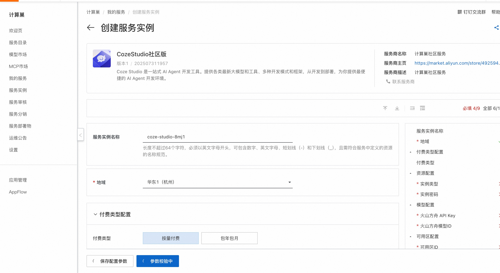
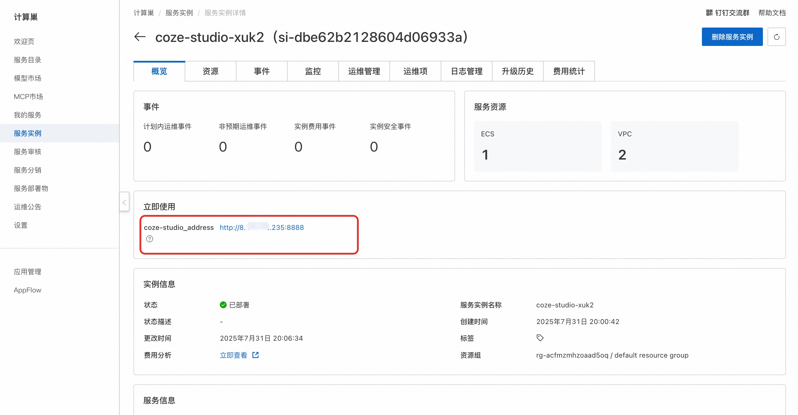
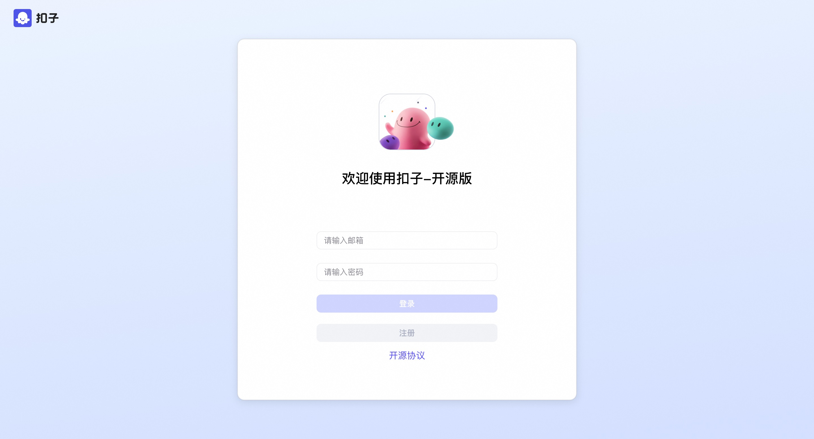

## 🌟 服务简介

Coze Studio 是一站式 AI Agent 开发工具。提供各类最新大模型和工具、多种开发模式和框架，从开发到部署，为你提供最便捷的 AI Agent 开发环境。

提供 AI Agent 开发所需的全部核心技术：Prompt、RAG、Plugin、Workflow，使得开发者可以聚焦创造 AI 核心价值。
开箱即用，用最低的成本开发最专业的 AI Agent：Coze Studio 为开发者提供了健全的应用模板和编排框架，你可以基于它们快速构建各种 AI Agent ，将创意变为现实。
Coze Studio，源自服务了上万家企业、数百万开发者的「扣子开发平台」，我们将它的核心引擎完全开放。它是一个一站式的 AI Agent 可视化开发工具，让 AI Agent 的创建、调试和部署变得前所未有的简单。通过 Coze Studio 提供的可视化设计与编排工具，开发者可以通过零代码或低代码的方式，快速打造和调试智能体、应用和工作流，实现强大的 AI 应用开发和更多定制化业务逻辑，是构建低代码 AI 产品的理想选择。Coze Studio 致力于降低 AI Agent 开发与应用门槛，鼓励社区共建和分享交流，助你在 AI 领域进行更深层次的探索与实践。

Coze Studio 的后端采用 Golang 开发，前端使用 React + TypeScript，整体基于微服务架构并遵循领域驱动设计（DDD）原则构建。为开发者提供一个高性能、高扩展性、易于二次开发的底层框架，助力开发者应对复杂的业务需求。

### 功能清单

<table>
<thead>
<tr>
<th><strong>功能模块</strong></th>
<th><strong>功能点</strong></th>
</tr>
</thead>
<tbody>
<tr>
<td>模型服务</td>
<td>管理模型列表，可接入OpenAI、火山方舟 等在线或离线模型服务</td>
</tr>
<tr>
<td>搭建智能体</td>
<td>* 编排、发布、管理智能体   * 支持配置工作流、知识库等资源</td>
</tr>
<tr>
<td>搭建应用</td>
<td>* 创建、发布应用   * 通过工作流搭建业务逻辑</td>
</tr>
<tr>
<td>搭建工作流</td>
<td>创建、修改、发布、删除工作流</td>
</tr>
<tr>
<td>开发资源</td>
<td>支持创建并管理以下资源：   * 插件   * 知识库   * 数据库   * 提示词</td>
</tr>
<tr>
<td>API 与 SDK</td>
<td>* 创建会话、发起对话等 OpenAPI   * 通过 Chat SDK 将智能体或应用集成到自己的应用</td>
</tr>
</tbody>
</table>

## 💰 计费说明

CozeStudio社区版在计算巢部署的费用主要涉及：

- 所选vCPU与内存规格
- 系统盘类型及容量
- 公网带宽

## 🚀 部署流程

1. 访问计算巢CozeStudio社区版[部署链接](https://computenest.console.aliyun.com/service/instance/create/cn-hangzhou?type=user&ServiceId=service-6378fe84a34a44d683fa)
，按提示填写部署参数：
   

2. 参数填写完成后可以看到对应询价明细，确认参数后点击**下一步：确认订单**。

3. 确认订单完成后同意服务协议并点击**立即创建**进入部署阶段。

4. 等待部署完成后就可以开始使用服务，进入服务实例详情点击服务地址。
   

5. 访问服务地址注册账号并使用CozeStudio社区版。
   

# 📚 使用指南

更多用法请参考CozeStudio[官网文档](https://www.coze.cn/open/docs/guides)。